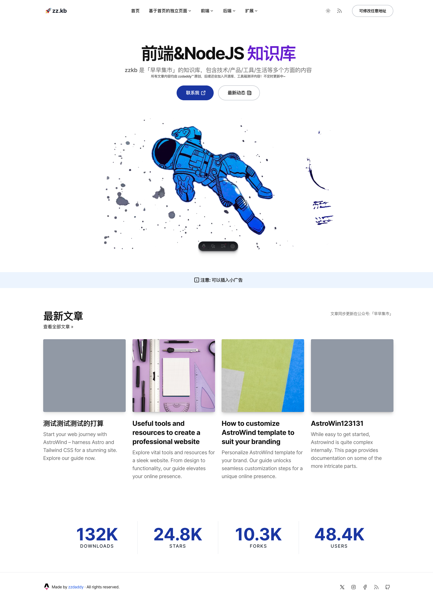

# 🚀 基于AstroWind的模板


🌟 _Most *starred* & *forked* Astro theme in 2022 & 2023_. 🌟

**AstroWind** is a free and open-source template to make your website using **[Astro 4.0](https://astro.build/) + [Tailwind CSS](https://tailwindcss.com/)**. Ready to start a new project and designed taking into account web best practices.

- ✅ **Production-ready** scores in **PageSpeed Insights** reports.
- ✅ Integration with **Tailwind CSS** supporting **Dark mode** and **_RTL_**.
- ✅ **Fast and SEO friendly blog** with automatic **RSS feed**, **MDX** support, **Categories & Tags**, **Social Share**, ...
- ✅ **Image Optimization** (using new **Astro Assets** and **Unpic** for Universal image CDN).
- ✅ Generation of **project sitemap** based on your routes.
- ✅ **Open Graph tags** for social media sharing.
- ✅ **Analytics** built-in Google Analytics, and Splitbee integration.

<br>

## 原模板界面


[](https://onwidget.com)
[](https://github.com/onwidget/astrowind/blob/main/LICENSE.md)
[](https://github.com/onwidget)
[](https://github.com/onwidget/astrowind#contributing)
[](https://snyk.io/test/github/onwidget/astrowind)
[](https://github.com/onwidget/astrowind)
[](https://github.com/onwidget/astrowind)

<br>

## 改造后界面



<br>

## 原模板Demo
📌 [https://astrowind.vercel.app/](https://astrowind.vercel.app/)

<br>

## 使用此模板

> 基于node 18.18.2测试和改造，前置环境请自行安装

1. 使用 `git` 克隆此仓库到本地
2. 使用 `pnpm i` 安装依赖项
3. 使用 `pnpm dev` 启动本地服务器预览项目

<br>

### 配置

配置文件位于: `./src/config.yaml`

```yaml
site:
  name: 'Example'
  site: 'https://example.com'
  base: '/' # Change this if you need to deploy to Github Pages, for example
  trailingSlash: false # Generate permalinks with or without "/" at the end

  googleSiteVerificationId: false # Or some value,

# Default SEO metadata
metadata:
  title:
    default: 'Example'
    template: '%s — Example'
  description: 'This is the default meta description of Example website'
  robots:
    index: true
    follow: true
  openGraph:
    site_name: 'Example'
    images:
      - url: '~/assets/images/default.jpg'
        width: 1200
        height: 628
    type: website
  twitter:
    handle: '@twitter_user'
    site: '@twitter_user'
    cardType: summary_large_image

i18n:
  language: en
  textDirection: ltr

apps:
  blog:
    isEnabled: true # If the blog will be enabled
    postsPerPage: 6 # Number of posts per page

    post:
      isEnabled: true
      permalink: '/blog/%slug%' # Variables: %slug%, %year%, %month%, %day%, %hour%, %minute%, %second%, %category%
      robots:
        index: true

    list:
      isEnabled: true
      pathname: 'blog' # Blog main path, you can change this to "articles" (/articles)
      robots:
        index: true

    category:
      isEnabled: true
      pathname: 'category' # Category main path /category/some-category, you can change this to "group" (/group/some-category)
      robots:
        index: true

    tag:
      isEnabled: true
      pathname: 'tag' # Tag main path /tag/some-tag, you can change this to "topics" (/topics/some-category)
      robots:
        index: false

    isRelatedPostsEnabled: true # If a widget with related posts is to be displayed below each post
    relatedPostsCount: 4 # Number of related posts to display

analytics:
  vendors:
    googleAnalytics:
      id: null # or "G-XXXXXXXXXX"

ui:
  theme: 'system' # Values: "system" | "light" | "dark" | "light:only" | "dark:only"
```

<br>

### 部署

#### 打包

You can create an optimized production build with:

```shell
npm run build
或
pnpm build
```

Now, your website is ready to be deployed. All generated files are located at
`dist` folder, which you can deploy the folder to any hosting service you
prefer.

#### 部署到 Netlify

Clone this repository on own GitHub account and deploy to Netlify:

[](https://app.netlify.com/start/deploy?repository=https://github.com/onwidget/astrowind)

#### 部署到 Vercel

Clone this repository on own GitHub account and deploy to Vercel:

[](https://vercel.com/new/clone?repository-url=https%3A%2F%2Fgithub.com%2Fonwidget%2Fastrowind)

<br>

## License

[MIT](./LICENSE.md)